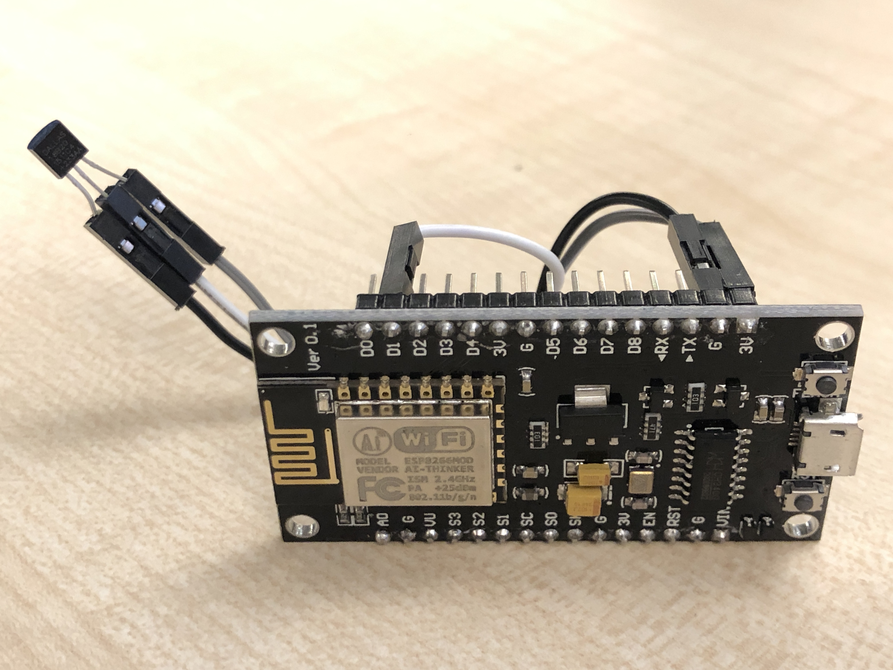

# smarthome-v4
New version of my heating system based on esp32, mongoose os, google iot

# Hardware

The projects works with ESP8266 and ESP32 controllers.
You can go only with central device (temperature sensor + relay to control heating system). For better experience it is recommended to have additional slave devices that measure temperature and send it to the central device. In this setup central device takes the minimal temperature from all devices as a reference for thermostat.

## ESP8266 with ds18b20

Connect data pin of ds18b20 into GPIO 5 (D1) of ESP8266 and VCC and GND to proper pins:




# Firmware installation

Set up your platform and serial port:

```
export MOS_PORT=/dev/cu.SLAB_USBtoUART
export MOS_PLATFORM=esp32
export SSID=your_home_network_name
export PASS=your_home_network_password
export AP_PASS=mongoose_access_point_password
```

Build firmware and flush your device:

    mos build
    mos flash

## Central device
Configure central device (hub):

    mos config-set wifi.sta.enable=true wifi.ap.enable=true  wifi.sta.ssid=$SSID wifi.sta.pass=$PASS wifi.ap.pass=$AP_PASS

(Optional) If you enabled GCP project you can connect device to IoT registry:
    mos gcp-iot-setup --gcp-project $GCP_PROJECT_ID --gcp-region europe-west1 --gcp-registry iot-registry

## Slave devices
When device is up find the access point SSID, in my case it was `Mongoose_2121D0`. Set up slave devices:
    mos config-set wifi.sta.enable=true wifi.ap.enable=false wifi.sta.ssid=Mongoose_2121D0 wifi.sta.pass=$AP_PASS   

